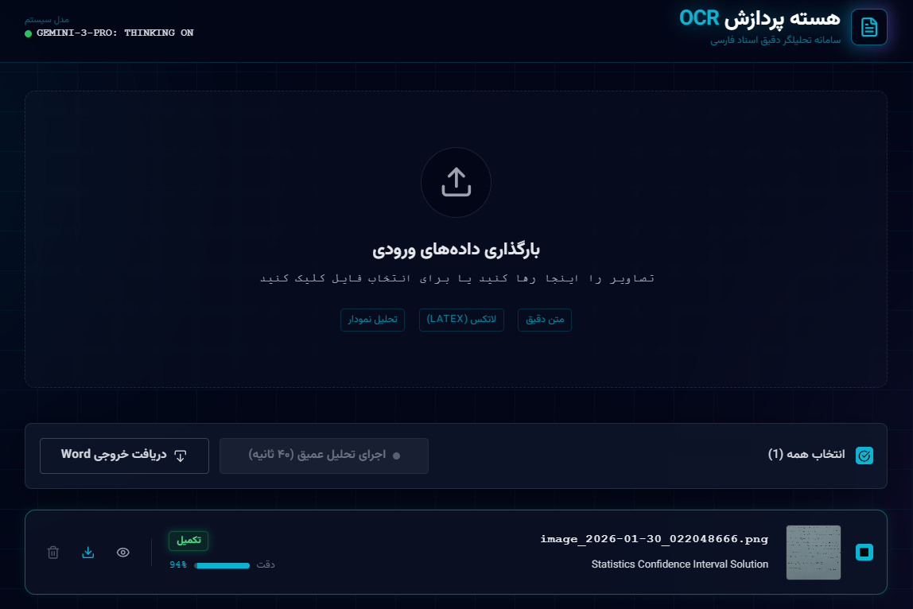

# PersianAI OCR Engine

High-Precision AI-Powered Text Extraction Platform  
With Mathematical Symbol & LaTeX Recognition

---

## 🔎 Overview

PersianAI OCR Engine is an advanced web-based OCR platform designed for high-accuracy text extraction from images.

Unlike traditional OCR systems, this application leverages state-of-the-art AI models to accurately recognize:

- 📐 Mathematical equations
- 🔣 Scientific symbols
- 🧮 LaTeX expressions
- 📄 Structured documents
- ✍️ Persian & multilingual text

Extracted content can be exported directly into **Microsoft Word (.docx)** format for seamless editing and publishing.

---

## ✨ Core Features

- 🧠 AI-powered OCR engine
- 📐 Math & LaTeX recognition
- 📄 Word (.docx) export
- ⚡ Fast image processing
- 🌐 Modern responsive UI
- 🔐 Secure API key handling

---

## 🏗 Architecture

The application is built as a modern web app using:

- Node.js
- JavaScript / TypeScript
- Google Generative AI API
- Document generation utilities

Environment-based API configuration ensures security and flexibility.

---

## ⚙️ Installation

### Prerequisites
- Node.js (v18+ recommended)

  

1. Install dependencies:
   `npm install`
2. Set the `GEMINI_API_KEY` in [.env.local](.env.local) to your Gemini API key
3. Run the app:
   `npm run dev`
